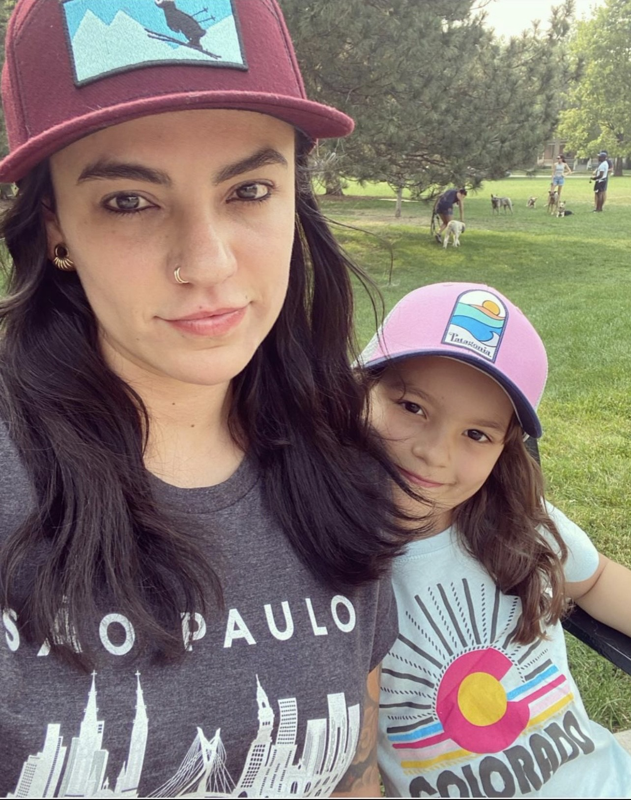

# My Personal Website
<html>
    <head>
    <title>Who is Gabi?</title>  
    </head>
    <body style="background-color: #8fbc8f;">
        
        
        <h1>This is Gabi's web page</h1>
            <h2>Who am I?</h2>
             
 I value clarity, emphaty and integrity above all else. 

        
These ideals guide my approach to problem solving and life in general.

        
I like photography and traveling.

        
I am currently shaping the future with software development.

        <a id="emailMe" href="gabbybailu@gmail.com">e-mail me</a>
        <form action="mailto:gabbybailu@gmail.com" method="post" enctype="text/plain" >
            FirstName:<input type="text" name="FirstName">
            Email:<input type="text" name="Email">
            <input type="submit" name="submit" value="Submit">
            </form>
    </body>
</html>

